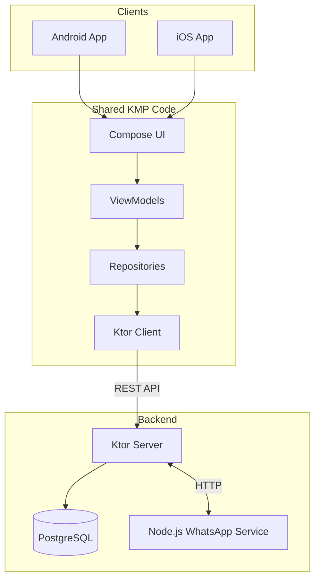

# Echo: Engineering Empathy with Kotlin Multiplatform

*How I built a "Calm" social app with 99% shared code using KMP, Compose Multiplatform, and Ktor.*

---

## 1. Introduction: The Noise vs. The Signal

In a world overflowing with "loud" social media—infinite scrolls, algorithmic outrage, and vanity metrics—I wanted to build something different. **Echo** is a quiet space where feelings return without names. It’s a place to express appreciation, acknowledge emotions, and build awareness without the pressure of confrontation or public performance.

But building a "calm" app doesn't mean "simple" engineering. To deliver a seamless, high-quality experience on both Android and iOS without managing two separate codebases, I turned to the cutting edge of cross-platform development: **Kotlin Multiplatform (KMP)** and **Compose Multiplatform**.

This article takes a "tech-first" deep dive into how Echo was built, from the shared UI to the Ktor backend that powers it all.

---

## 2. The Tech Stack: A Symphony of Kotlin

The core philosophy was "Write Once, Run Everywhere," but without satisfying the user experience. By using Kotlin across the entire stack, we achieved synergy that traditional cross-platform frameworks often miss.

### The Ecosystem
*   **Common Logic**: Kotlin Multiplatform (KMP) handles networking, data storage, and domain rules.
*   **UI**: **Compose Multiplatform** provides a unified, declarative UI framework for both Android and iOS.
*   **Backend**: **Ktor Server** running on the JVM.
*   **Web**: A high-performance **Vite** landing page and a **Next.js** Admin Portal.

### High-Level Architecture


---

## 3. Unified UI with Compose Multiplatform

One of the biggest wins was sharing the **entire** UI layer. Unlike KMP's early days where you only shared business logic, Compose Multiplatform allowed me to define the design system once.

### One Code, Two Platforms
We created a custom `AppTheme` that adapts to system preferences (Light/Dark mode) on both OSs. Complex components like the `EchoCard` (the swipe-to-reveal interface) are written purely in Kotlin.

```kotlin
// A literal implementation example used on both Android and iOS
@Composable
fun EchoCard(
    emotion: Emotion,
    content: String,
    modifier: Modifier = Modifier
) {
    Card(
        modifier = modifier.fillMaxWidth(),
        colors = CardDefaults.cardColors(containerColor = emotion.color)
    ) {
        Text(text = content, style = MaterialTheme.typography.bodyLarge)
    }
}
```
This isn't a webview. It compiles to native UI calls, ensuring 60fps animations and native gesture handling.

---

## 4. The "Gentle" Notification System

Notifications in a calm app shouldn't induce anxiety. We architected a system that respects user boundaries while ensuring important "Echoes" are felt.

### Platform-Specific nuances & Koin
We used **Koin** for dependency injection to handle platform differences cleanly.
*   **Android**: Uses `AndroidFcmTokenProvider` and Notification Channels (`feelings`, `rewards`, `checkins`) to give users granular control.
*   **iOS**: Uses `IosFcmTokenProvider`. We send specific APNs payloads with a custom sound file `echo_notification.wav` bundled in the app, providing a gentle "ping" instead of a jarring system default sound.

### Smart Logic
The server's `NotificationService` actively checks user preferences before sending.
```kotlin
// Server-side preference check strictly enforced
val user = userRepository.getUserDetails(userId)
if (user.notify_rewards == false) return // Abort
```

---

## 5. Backend Architecture: Ktor & Performance

Using Kotlin on the backend was a strategic choice. It allowed us to share **Data Transfer Objects (DTOs)** between the App and the Server.

**The Benefit**: No more JSON parsing errors. If I rename a field in the `SendMessageRequest` class in the `Shared` module, the compiler updates both the mobile app and the server code instantly.

### Optimizations & Concurrency
*   **Coroutines**: Ktor is built on coroutines, allowing us to handle thousands of concurrent connections with minimal thread overhead.
*   **Type-Safe SQL with Exposed**: We use the **Exposed** ORM to write safe, compile-time checked queries.
    ```kotlin
    // Complex join without a single line of raw SQL
    Messages.innerJoin(Users)
        .join(Replies, JoinType.LEFT)
        .select(Messages.content, Users.username, Replies.content)
        .where { Messages.receiverId eq currentUserId }
    ```
*   **Batching**: The `NotificationService` processes seasonal rewards in chunks of 50 users. A custom coroutine-based `NotificationScheduler` runs these jobs, ensuring we don't spike the database load at 8 AM when creating daily notifications.

---

## 6. Integrations & Microservices

While Kotlin does 99% of the work, we utilize specialized tools where they shine.

### WhatsApp Sidecar (Node.js)
To handle phone number verification via WhatsApp, we integrated a **Node.js sidecar service** using the `Baileys` library. The Ktor server communicates with this microservice via internal HTTP calls to send OTPs. This keeps the main application logic pure Kotlin while leveraging the rich Node.js ecosystem for specific protocols.

### The Web Ecosystem
*   **Website**: Built with **Vite** for zero-latency loading and SEO optimization.
*   **Admin Portal**: A **Next.js** application that proxies requests to the Ktor API, giving us a powerful dashboard to manage users, view analytics, and oversee community health.

---

## 7. Privacy: Hashing & Contact Sourcing

Echo allows you to find friends, but we respect privacy. We **never** store user phone numbers in plain text.
1.  **Local Fetch**: The app reads contacts on the device.
2.  **Hashing**: Numbers are hashed (SHA-256) *on the device* before leaving.
3.  **Matching**: The server receives only hashes and matches them against registered user hashes.
4.  **Result**: You see your friends, but we never see their raw numbers.

---

## Conclusion

Building Echo with Kotlin Multiplatform wasn't just about code reuse; it was about **velocity**. A small team (or even a single developer) can build a production-grade, full-stack system—iOS, Android, Backend, and Web—without context switching between languages.

Technical simplifications like shared DTOs and unified UI logic allowed us to focus on what matters: crafting a "calm" experience that feels native, responsive, and human.

<a href="https://play.google.com/store/apps/details?id=com.bhanit.apps.echo">
  
<a href="https://apps.apple.com/in/app/echo-feelings-come-back/id6757484280">
  
</a>
