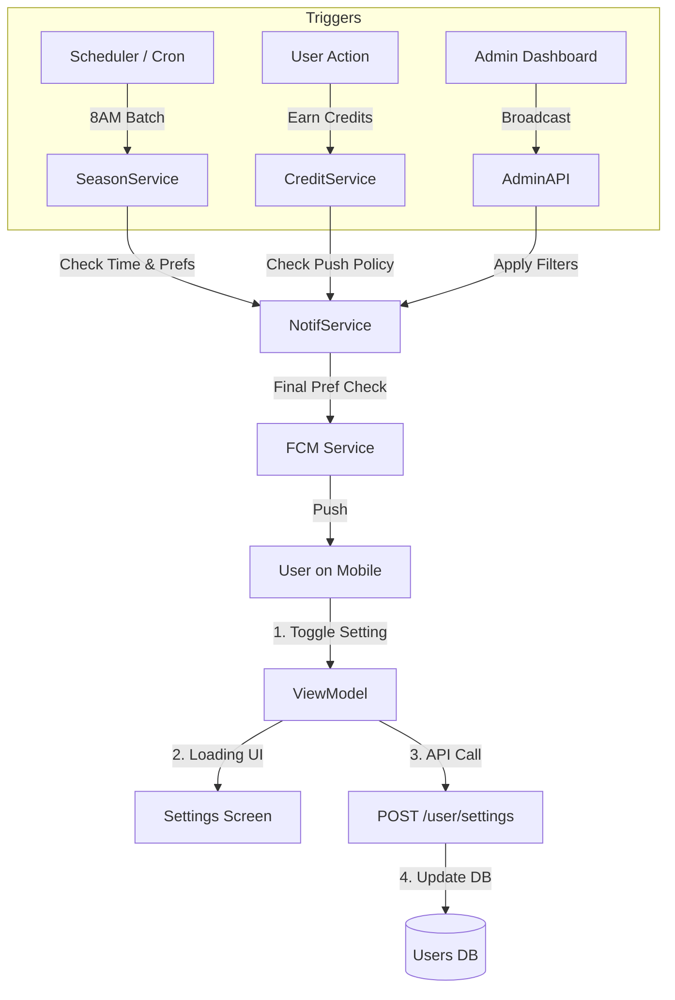

# Echo Notification System Architecture

This document outlines the complete flow of notifications within the Echo ecosystem, from the mobile client to server-side triggers and specific reward logic.

## 1. Mobile App (Client)
The client is responsible for generating the FCM token, managing user preferences, and displaying notifications.

### A. FCM Registration
1.  **Startup**: App initializes Firebase Messaging.
2.  **Token Generation**: Retrieves the `fcm_token`.
3.  **Sync**: Sends the token to the server via `POST /user/fcm` (or similar auth flow).
4.  **Token Refresh**: Listens for new tokens and updates the server automatically.

### B. Notification Channels (Android)
To ensure granular control, the app defines specific channels (Platform requirement):
*   **`feelings`**: For replies and interactions.
*   **`checkins`**: For "Gentle Check-ins" (engagement).
*   **`reflections`**: For daily reflections.
*   **`rewards`**: For credits and streaks.
*   **`updates`**: For critical app updates (cannot be disabled).

### C. User Settings (Toggles)
Users control their preferences via `NotificationSettingsScreen`.
*   **Optimistic UI**: Toggles update visually immediately.
*   **Loading State**: Shows a spinner while syncing.
*   **Sync**: Calls `POST /user/settings/notifications`.
*   **Rollback**: If the API fails (e.g., no internet), the toggle reverts automatically.

---

## 2. Server (Backend)
The server acts as the central brain, deciding *when* and *to whom* to send notifications.

### A. Data Model (Users Table)
We added specific columns to respect user opt-outs efficiently:
*   `notify_feelings` (bool)
*   `notify_checkins` (bool)
*   `notify_reflections` (bool)
*   `notify_rewards` (bool)
*   `notify_inactive_reminders` (bool)

### B. Service Layer (`NotificationService`)
All logic resides here. Before sending *any* notification, the service performs a **Preference Check**:
```kotlin
val user = userRepository.getUserDetails(userId)
if (user.notify_rewards == false) return // Abort
```

### C. Admin & Broadcast
*   **Function**: `broadcastNotification(title, body, filters)`
*   **Capabilities**: Can target users based on:
    *   Platform (Android/iOS)
    *   App Version (`minVersion`)
    *   Inactivity (`daysInactive`)
    *   Onboarding Status
*   **Usage**: Used for system updates or community announcements.

---

## 3. Specific Notification Flows

### A. Reward Notifications
Triggered when a user earns credits.
1.  **Trigger**: `CreditService.awardCredits()` is called (e.g., for a Streak).
2.  **Service**: Calls `NotificationService.sendRewardNotification()`.
3.  **Check**: Verifies `notify_rewards = true`.
4.  **Push Policy**: Checks `shouldSendPush()`.
    *   **Major Events** (Season Start, First Echo): **SEND PUSH**.
    *   **Routine Events** (Daily Streak): **SILENT/IN-APP ONLY** (to maintain "Calm" design).
5.  **Template**: Selects "Echo-Safe" copy (e.g., "Consistency noticed").

### B. Seasonal Notifications
1.  **Scheduler**: `checkSeasonStartNotifications()` runs periodically (via Cron/Scheduler).
2.  **Batching**: Processing occurs in **Parallel Batches of 50 users** to protect server performance.
3.  **Time Check**: Only processes users where local time is **08:00 - 12:00**.
4.  **Logic**:
    *   Checks if a Season (e.g., "Valentine's") starts today.
    *   Checks if `notify_rewards = true`.
    *   Checks if user has already received this season's start notification (`metaJson` flag).
5.  **Delivery**: Sends generic "Season Start" message with a deep link to the Journey path.

### C. Engagement (Retention)
1.  **Unopened App**: Checks `notify_inactive_reminders`. Sends if user hasn't opened app recently (but rate-limited to 1/day).
2.  **Engagement Prompt**: Checks `notify_checkins`. Sends if user hasn't sent an Echo today (warm nudge).

---

## 4. Flow Diagram


