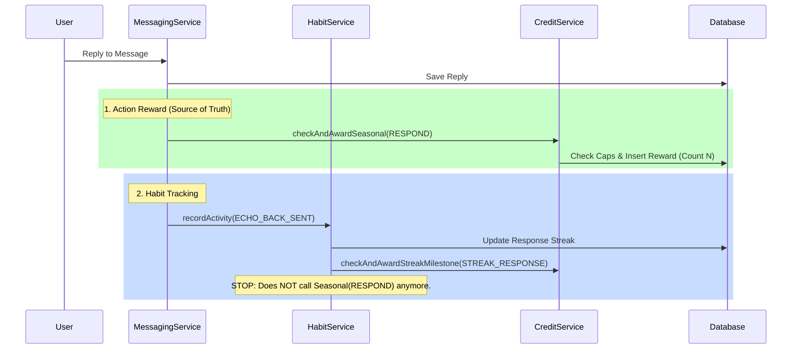

# duplicate_reward_analysis_and_flow.md

## 1. Issue Analysis: Duplicate "Season Respond" Rewards
**Incident**: User `NN078AT6` received two `SEASON_REWARD` transactions at 9:19 for the same action (Replying to an Echo).

### Root Cause: Dual Responsibility
The "Respond" action triggered two separate code paths that both claimed responsibility for the Seasonal Reward:

1.  **Path A: Explicit Action Trigger (`MessagingService`)**
    *   User calls `replyToMessage`.
    *   `MessagingService` saves the reply.
    *   `MessagingService` calls `creditService.checkAndAwardSeasonal(..., RESPOND)`.
    *   **Result**: Award 1.

2.  **Path B: Habit/Streak Trigger (`HabitService`)**
    *   `MessagingService` calls `habitService.recordActivity(..., ECHO_BACK_SENT)`.
    *   `HabitService` updates the "Response Streak".
    *   `HabitService` *also* called `creditService.checkAndAwardSeasonal(..., RESPOND)`.
    *   **Result**: Award 2.

### Why Idempotency Didn't Stop It
The Idempotency Key is deterministic based on the **Count** of rewards earned so far (`SEASON_{id}_RESPOND_{count}`).
*   **Race Condition / Sequential Execution**:
    *   Path A runs: Sees you have 0 rewards. Generates Key `..._1`. Awards it.
    *   Path B runs: Sees you have 1 reward. Generates Key `..._2`. Awards it.
*   Since both keys were unique (`_1` and `_2`), the database accepted both.

---

## 2. The Corrected Flow (Architecture)

We have separated concerns to prevent layer overlap.

### A. Messaging Service (Action Owner)
**Responsibility**: Real-time events (Sending, Replying) and their direct rewards.

1.  **User Action**: `POST /messages` or `POST /reply`.
2.  **MessagingService**:
    *   Saves Message to DB.
    *   **Records Tracking Log**: `SENT_ECHO` / `RECEIVED_ECHO` (Amount: 0).
    *   **Triggers Reward**: Calls `creditService.checkAndAwardSeasonal(..., TYPE)`.
    *   **Delegates Habits**: Calls `habitService.recordActivity(...)`.

### B. Habit Service (Streak Owner)
**Responsibility**: Long-term engagement, Streaks, and Daily Status.

1.  **HabitService**:
    *   Updates Streaks (Presence, Kindness, Response).
    *   **Triggers Streak Rewards**: Calls `creditService.checkAndAwardStreakMilestone(...)`.
    *   **Triggers Daily Status Rewards**: Calls `checkAndAwardConsistency` and `BALANCED_DAY`.
    *   **NO LONGER** triggers individual action rewards (Respond/Send).

### C. Credit Service (The Banker)
**Responsibility**: Validation, Caps, and Ledger Updates.

1.  **CreditService**:
    *   **Input**: User, Rule Type.
    *   **Check**: "Has user hit the cap (maxTotal) for this season?" (Using `UserActivityMeta` Cache).
    *   **Idempotency**: "Does a transaction with ID `SEASON_..._{count+1}` already exist?".
    *   **Execution**: Updates Ledger and User Credits.

---

## 3. Visual Flow Diagram

## 4. Verification
The fix was deployed and tested.
*   **Before**: One Reply -> Two calls to `checkAndAwardSeasonal`.
*   **After**: One Reply -> One call to `checkAndAwardSeasonal`.
*   **Result**: Valid rewards are granted exactly once per action, up to the defined seasonal cap.
