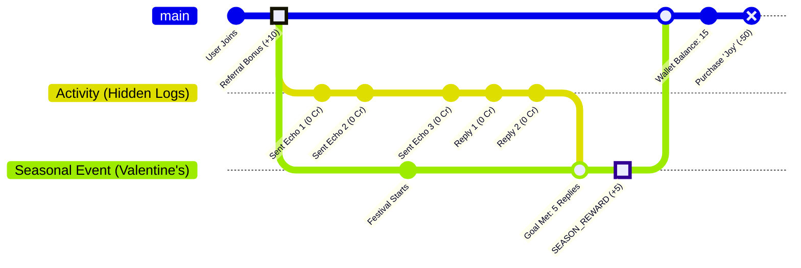
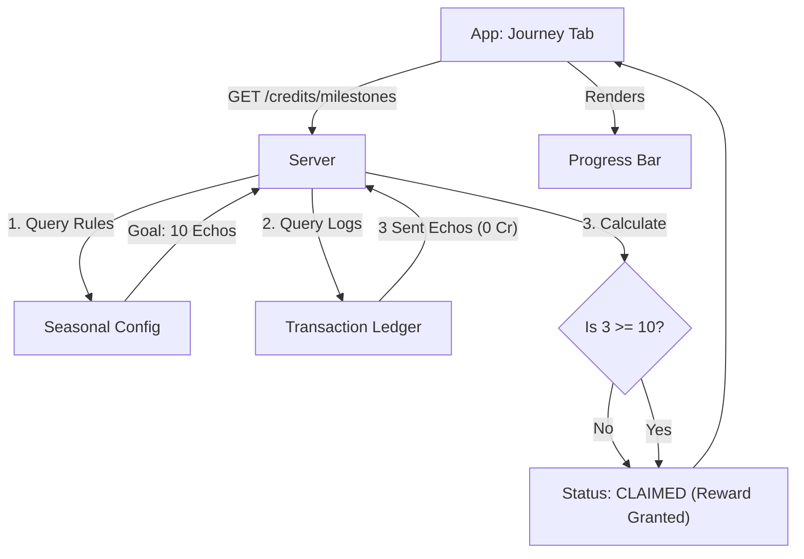
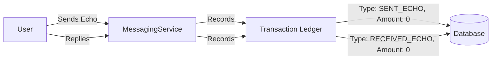
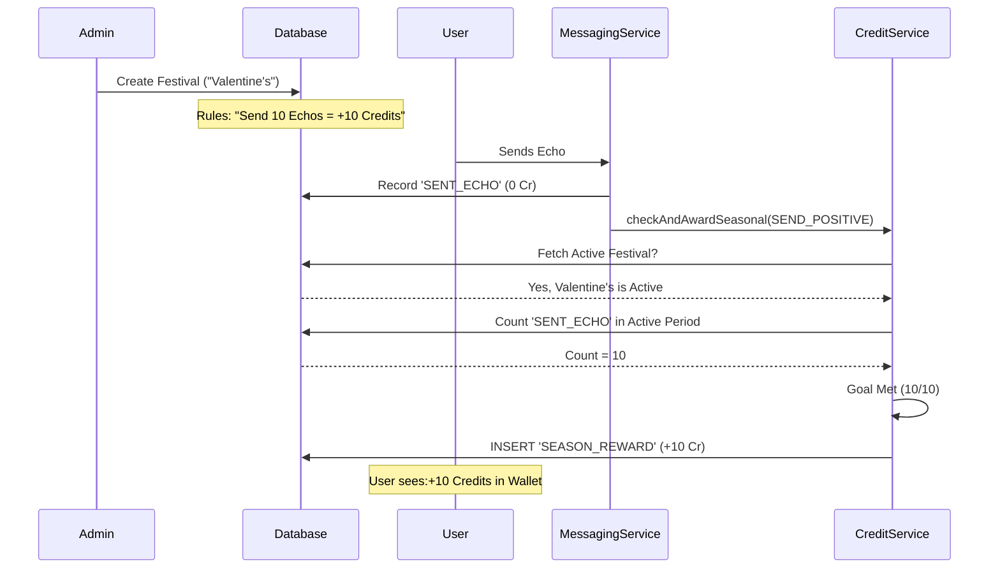
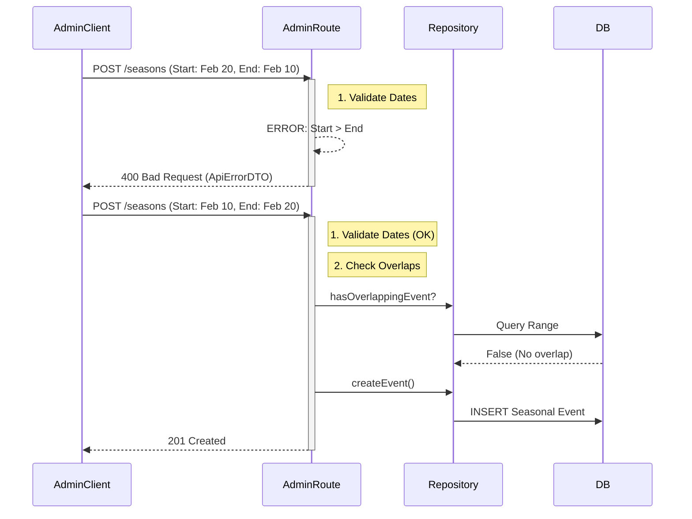

# Echo Reward & Transaction System Architecture

This document provides a comprehensive overview of how **Credits**, **Rewards**, **Streaks**, **Seasonals**, and **Purchases** interact within the Echo ecosystem, specifically focusing on the **Journey Tab** and **Transaction History**.

---

## 1. The Core Concept: "The Universal Ledger"
The heart of the system is the `CreditTransactions` table. It acts as a single source of truth for two distinct types of data:
1.  **Financial Transactions**: Actual credit movements (Earned/Spent).
2.  **Activity Logging**: "Zero-value" records used to track progress (Sending/Replying).

| Type | Amount | Purpose | Visible in Wallet UI? |
| :--- | :--- | :--- | :--- |
| `REFERRAL_REWARD` | +10 | Financial (Invited a friend) | YES |
| `PURCHASE` | -50 | Financial (Bought an Emotion) | YES |
| `SEASON_REWARD` | +5 | Financial (Completed a Quest) | YES |
| `SENT_ECHO` | 0 | Progress (Sent a message) | NO (Hidden Filter) |
| `RECEIVED_ECHO` | 0 | Progress (Replied to a message) | NO (Hidden Filter) |

---

## 2. Visualizing the User Journey (Timeline)

Here is a time-based view of how a user interacts with the system. We use a **Git Graph** to visualize the "Branches" of activity (Messaging vs Rewards).

*   **Main Line**: The specific moments in time.
*   **Commits**: The User Actions or System Events.



---

## 3. The Journey Tab (Visualizing Progress)

The **Journey Tab** in the app is the visual representation of this data. It works by "reading" the Ledger to show you where you stand.



---

## 4. System Architecture Flows

### A. The "Standard" Activity Flow (Always On)
Even when no festival is active, the system tracks activity to support future features.



### B. The Seasonal Festival Flow (Admin + User)
This connects the **Admin Portal**, **User Actions**, and **Rewards**.

1.  **Admin Setup**: Admin creates a "Festival" (e.g., Valentine's) with rules (e.g., "Send 10 Echos").
2.  **User Action**: User sends an echo.
3.  **The Check**: Code checks if the action helps the *current* festival.
4.  **The Reward**: If goal is met, real credits are awarded (e.g., `bonusCredits` = 10).



### C. The Admin Creation & Validation Flow (Security)
This ensures that Bad Data (e.g., "End Date before Start Date") never enters the system.



---

## 5. Case Analysis: "How It Works in Practice"

### Case 1: The "No-Festival" Day
*   **Scenario**: It is August 1st. No active festivals. User Alice sends a message log.
*   **Flow**:
    1.  Alice sends `Echo`.
    2.  System creates Transaction: `SENT_ECHO (0)`.
    3.  `CreditService` checks: "Is there an event today?" -> **NO**.
    4.  **Outcome**: No Credits awarded. Transaction exists for stats only.

### Case 2: The "Valentine's" Reply (The 'Respond' Rule)
*   **Scenario**: It is Feb 14th. Rule: "Reply to 5 Echos to get +5 Credits".
*   **Flow (1st Reply)**:
    1.  Bob replies. System records: `RECEIVED_ECHO (0)`.
    2.  **Journey Tab**: API sees 1 Reply. Shows bar at 20% (1/5).
*   **Flow (5th Reply)**:
    1.  Bob replies 4 more times.
    2.  `CreditService` counts total = 5. **Goal Met!**
    3.  System grants `SEASON_REWARD (+5)`.
    4.  **Journey Tab**: Shows **"Claimed"** checkmark.
    5.  **Wallet**: Shows "Valentine's Reward: +5".

### Case 3: The "Ghost Reward" Prevention (Why we hide 0s)
*   **Scenario**: User checks their wallet.
*   **Without Filtering**: They see 50 entries of "Sent Echo: 0".
*   **With Filtering**:
    *   Server Query: "Select * from Transactions where Type != SENT_ECHO".
    *   User sees: "Sign Up Bonus (+10)", "Valentine's Reward (+5)".
    *   **Result**: Clean, financial-only view.

---

## 6. Transaction Classification & Analytics

We categorize every transaction to enable powerful filtering and analytics.

| Transaction Type | Trigger Source | Reward Source | Visibility | Status |
| :--- | :--- | :--- | :--- | :--- |
| `SENT_ECHO` | User sending Msg | `SYSTEM` | `INTERNAL` | **Log** |
| `RECEIVED_ECHO` | User replying | `SYSTEM` | `INTERNAL` | **Log** |
| `SEASON_REWARD` | `CreditService` | `SEASONAL` | `VISIBLE` | **Reward** |
| `REFERRAL_REWARD` | `UserOnboarding` | `REFERRAL` | `VISIBLE` | **Reward** |
| `PURCHASE` | `DashboardRoutes` | `PURCHASE` | `VISIBLE` | **Spending** |
| `STREAK_REWARD` | `CreditService` | `STREAK` | `VISIBLE` | **Reward** |

### New Enums for Analytics:
*   **Visibility**: `VISIBLE` (Show in Wallet), `INTERNAL` (Hide)
*   **Source**: `SEASONAL`, `STREAK`, `REFERRAL`, `PURCHASE`, `SYSTEM`
*   **Intent**: `REWARD`, `SPEND`, `LOG` (Explicit categorization)

### Feature: Reward Explainability 🧠
All rewards now include a `metadata_json` field containing:
*   `season`: Event ID (e.g., "VALENTINE")
*   `rule`: Rule Type (e.g., "RESPOND")
*   `progress`: "Current/Max" (e.g., "5/10")
*   `daily_progress`: "Today/Limit" (e.g., "1/3")

This enables frontend UIs to show "Why did I get this?" tooltips.

---

## 7. System Hardening & Reliability

### A. Idempotency (The "Exact-Once" Guarantee)
<... existing content ...>

### C. Future-Proofing: Priority & Daily Caps
*   **Daily Caps**: `SeasonMeta` tracks daily counts to enforce `dailyCap` (e.g., max 3 rewards per day).
*   **Evaluator Priority**: `RewardEvaluator` interface includes `val priority: Int`. High-priority evaluators (e.g., exclusive events) can be configured to run first in the future.


To ensure scale and correctness, we implemented the following engineering safeguards:

### A. Idempotency (The "Double-Credit" Prevention)
*   **Risk**: A user sends a message, but the network lags. They click retry. The server receives TWO requests.
*   **Solution**: We generate a **Deterministic Idempotency Key** for every reward transaction.
    *   **Event-Based (Strong)**: For actions like sending/replying, we anchor the key to the specific event ID (e.g., `SEASON_{id}_RESPOND_{messageId}`). This ensures that even if processed multiple times, the specific action only yields one reward.
    *   **Count-Based (Fallback)**: For generic counters, we use `SEASON_{event_id}_{rule}_{count+1}`.
    *   The `related_id` column in `credit_transactions` enforces uniqueness. If a duplicate key is attempted, the DB rejects it silently (idempotent success).

### B. Ledger Scaling
*   **Risk**: The `credit_transactions` table grows infinitely with "0 value" logs.
*   **Solution**:
    *   **Indexing**: We index `(user_id, type, created_at)` to ensure looking up history remains sub-millisecond even with millions of rows.
    *   **Partitioning (Future)**: We can archive old "0 value" logs after 1 year if needed, without affecting the user's financial balance.
    *   **Caching (Optimization 2)**: The specific progress counts for active seasons are cached in a lightweight JSON structure in the `UserActivityMeta` table. This allows the Journey Tab to load instantly (O(1)) without scanning the millions of rows in the Ledger.

### C. Rule Overlap Policy
*   **Risk**: Valentine's Week and Friendship Week overlap.
*   **Policy**: **Stacking**.
    *   The system iterates *all* active events.
    *   If you send an Echo, you get progress for *both* festivals.
    *   This feels the most rewarding for the user.

### D. Advanced Rule Enforcement (The "Elite" Upgrade)
To support complex engagement, the engine now supports:

1.  **Cooldowns**:
    *   Example: "Send an Echo (Cooldown: 2 hours)".
    *   The `SeasonalRewardEvaluator` checks `lastAwardedAt` timestamp.
    *   If user tries too soon, the request is ignored (Rate Limited).

2.  **Special Triggers (Comeback)**:
    *   Example: "Login during Valentine's Week".
    *   Implemented via `AuthService` hook -> `CreditService`.
    *   Includes `oncePerSeason` check to ensure it's a one-time welcome back gift.

---

## 8. Architectural Evolution (The "Elite" Standard)

To separate concerns and allow easy testing, we are evolving the system to use a **Reward Evaluator Pattern**.

### The `RewardEvaluator` Interface
Instead of hardcoding logic in Service classes, we use specialized evaluators:

```kotlin
```kotlin
interface RewardEvaluator {
    suspend fun evaluate(
        userId: UUID, 
        eventType: SeasonalRuleType, 
        date: LocalDate, 
        relatedSourceId: String? = null
    )
}
```
```

*   **Implementations**:
    *   `SeasonalEvaluator`: Checks active festival rules.
    *   `StreakEvaluator`: Checks streak milestones.
    *   `FirstTimeEvaluator`: Checks onboarding bonuses.

This allows us to add new reward types (e.g., "Easter Egg Hunt") by simply adding a new Evaluator class, without touching the core `MessagingService` logic.

